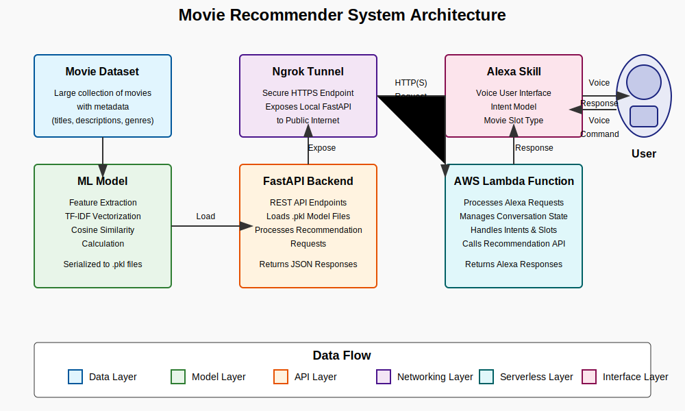

# Movie Recommender for IoT Devices

A complete voice-driven movie recommendation system built with Amazon Alexa, AWS Lambda, FastAPI, and machine learning that provides personalized movie recommendations based on user preferences. This architecture is designed to be adaptable for any IoT device with voice capabilities, not just Alexa devices, with future updates planned to expand compatibility and features.

## Table of Contents

- [Overview](#overview)
- [Project Architecture](#project-architecture)
- [Technical Components](#technical-components)
  - [Machine Learning Model](#machine-learning-model)
  - [Movie Recommendation API](#movie-recommendation-api)
  - [Ngrok Tunnel](#ngrok-tunnel)
  - [AWS Lambda Function](#aws-lambda-function)
  - [Alexa Skill](#alexa-skill)
- [Setup and Deployment](#setup-and-deployment)
  - [ML Model Training](#ml-model-training)
  - [API Setup](#api-setup)
  - [Ngrok Configuration](#ngrok-configuration)
  - [Lambda Function Setup](#lambda-function-setup)
  - [Alexa Skill Setup](#alexa-skill-setup)
- [Testing](#testing)
  - [Lambda Testing](#lambda-testing)
  - [Alexa Skill Testing](#alexa-skill-testing)
- [User Interaction Flow](#user-interaction-flow)
- [Troubleshooting](#troubleshooting)
- [Future Enhancements](#future-enhancements)

## Overview

The Movie Recommender Alexa Skill allows users to get personalized movie recommendations through voice interaction. Using machine learning techniques and natural language processing, the system analyzes movie content and provides recommendations based on similarity to movies the user already likes.

Key features:
- Voice-activated movie recommendations
- TF-IDF and cosine similarity-based recommendation algorithm
- Multi-turn conversations (ability to ask for more recommendations)
- Seamless integration between Alexa and a custom recommendation API
- Machine learning powered content-based filtering

## Project Architecture


The system consists of five main components arranged in a pipeline architecture:

1. **Machine Learning Model**: A TF-IDF vectorization model trained on movie metadata to extract features and calculate cosine similarity between movies.
2. **Movie Recommendation API**: A FastAPI-based service that loads the trained model and provides recommendation endpoints.
3. **Ngrok Tunnel**: Exposes the local API to the internet through a secure HTTPS endpoint.
4. **AWS Lambda Function**: Processes Alexa requests, manages conversation state, and communicates with the API.
5. **Alexa Skill**: The voice interface that users interact with.



### Data Flow

1. User speaks to an Alexa device requesting movie recommendations
2. Alexa Skill captures the request and sends it to the AWS Lambda function
3. Lambda function extracts the movie name and sends a request to the Recommendation API via Ngrok
4. API loads the pre-trained ML model (TF-IDF and cosine similarity matrix) and finds similar movies
5. API returns JSON response with recommendations
6. Lambda processes the response and formats it for Alexa
7. Alexa delivers the recommendation to the user via voice

## Technical Components

### Machine Learning Model

The recommendation system uses a content-based filtering approach with TF-IDF (Term Frequency-Inverse Document Frequency) vectorization.

**Key Components:**
- **TF-IDF Vectorization**: Converts movie metadata (descriptions, genres, keywords) into numerical feature vectors
- **Cosine Similarity**: Measures the similarity between movies based on their feature vectors
- **Pre-computed Matrix**: Similarity scores are pre-computed and stored for efficient retrieval

**Model Training Process:**
1. Extract features from movie metadata (title, description, genres, keywords)
2. Apply TF-IDF vectorization to convert text features to numerical vectors
3. Calculate cosine similarity between all movie pairs
4. Store the similarity matrix and movie titles in pickle files for fast loading

**Files:**
- `model/cosine_sim.pkl`: Pre-computed cosine similarity matrix
- `model/movie_titles.pkl`: List of movie titles

### Movie Recommendation API

A FastAPI-based API that loads the trained model and provides movie recommendations.

**Key Features:**
- RESTful endpoints for movie recommendations
- Dynamic loading of pre-trained models
- Configurable number of recommendations
- Error handling for unknown movies

**Endpoints:**
- `GET /recommend?movie_name=<movie_title>`: Returns top 5 similar movies

**Implementation:**
```python
@app.get("/recommend")
def recommend_movie(movie_name: str):
    try:
        # Find the movie index from movie_titles
        if movie_name not in movie_titles:
            return {"error": "Movie not found."}

        movie_index = movie_titles.index(movie_name)

        # Get the similarity scores for the given movie
        similarity_scores = list(enumerate(cosine_sim[movie_index]))

        # Sort the movies by similarity
        sorted_scores = sorted(similarity_scores, key=lambda x: x[1], reverse=True)

        # Return the top 5 recommended movies
        recommended_movies = []
        for i in range(1, 6):  # Skipping the first movie as it's the input movie itself
            idx = sorted_scores[i][0]
            recommended_movies.append(movie_titles[idx])

        return {"recommended_movies": recommended_movies}

    except Exception as e:
        return {"error": str(e)}
```

### Ngrok Tunnel

Ngrok creates a secure tunnel to expose the locally hosted FastAPI service to the internet.

**Key Features:**
- Provides a public HTTPS URL for the local API
- Enables secure communication between AWS Lambda and the API
- Includes request inspection and debugging tools

**Configuration:**
```bash
ngrok http 8000  # Assuming FastAPI runs on port 8000
```

### AWS Lambda Function

The Lambda function processes requests from the Alexa Skill and communicates with the recommendation API.

**Key Features:**
- Handles Alexa intent requests
- Manages conversation state using session attributes
- Communicates with the recommendation API
- Implements error handling and fallbacks

**Core Functions:**
- Processing LaunchRequest
- Handling RecommendMovieIntent with movie name slot
- Managing follow-up requests for more recommendations
- Formatting responses for Alexa

### Alexa Skill

The Alexa Skill provides the voice interface users interact with.

**Key Features:**
- Custom invocation name: "movie recommender"
- Natural language interaction
- Multi-turn conversation support
- Slot for capturing movie names

**Interaction Model:**
- Invocation: "Alexa, open movie recommender"
- Sample Utterances:
  - "I like The Matrix"
  - "Recommend me something like Inception"
  - "More recommendations"

## Setup and Deployment

### ML Model Training

1. Prepare your movie dataset with metadata (titles, descriptions, genres)
2. Install required libraries:
   ```
   pip install scikit-learn pandas numpy joblib
   ```
3. Create and run the training script:
   ```python
   import pandas as pd
   from sklearn.feature_extraction.text import TfidfVectorizer
   from sklearn.metrics.pairwise import cosine_similarity
   import joblib

   # Load your movie data
   movies = pd.read_csv('movies_metadata.csv')
   
   # Prepare text data for TF-IDF (combine relevant features)
   movies['content'] = movies['overview'] + ' ' + movies['genres']
   
   # Create TF-IDF vectors
   tfidf = TfidfVectorizer(stop_words='english')
   tfidf_matrix = tfidf.fit_transform(movies['content'])
   
   # Calculate cosine similarity
   cosine_sim = cosine_similarity(tfidf_matrix, tfidf_matrix)
   
   # Save the model and data
   movie_titles = movies['title'].tolist()
   joblib.dump(cosine_sim, 'model/cosine_sim.pkl')
   joblib.dump(movie_titles, 'model/movie_titles.pkl')
   ```

### API Setup

1. Install FastAPI and dependencies:
   ```
   pip install fastapi uvicorn joblib
   ```

2. Create the FastAPI application:
   ```python
   from fastapi import FastAPI
   import joblib

   app = FastAPI()

   # Load the pre-trained model and movie titles
   cosine_sim = joblib.load('model/cosine_sim.pkl')
   movie_titles = joblib.load('model/movie_titles.pkl')

   @app.get("/recommend")
   def recommend_movie(movie_name: str):
       # Implementation as shown in the Technical Components section
   ```

3. Start the FastAPI server:
   ```
   uvicorn app:app --reload
   ```

### Ngrok Configuration

1. Download and install ngrok from [https://ngrok.com/download](https://ngrok.com/download)
2. Start ngrok to expose your FastAPI server:
   ```
   ngrok http 8000
   ```
3. Copy the HTTPS URL provided by ngrok (e.g., `https://a1b2c3d4.ngrok.io`)

### Lambda Function Setup

1. Create a new Lambda function in AWS console:
   - Function name: `alexa-movie-recommender`
   - Runtime: Python 3.8+
   - Role: Create a basic Lambda role with logging permissions

2. Upload the Lambda code:
   - Copy the provided Lambda function code
   - Replace `API_ENDPOINT` with your ngrok URL + "/recommend"
   - If using mock data (for testing), ensure the mock section is uncommented

3. Configure the Lambda trigger:
   - Add an Alexa Skills Kit trigger
   - Enter your Alexa Skill ID when available

### Alexa Skill Setup

1. Create a new skill in the Alexa Developer Console:
   - Skill name: "Movie Recommender"
   - Invocation name: "movie recommender"
   - Choose a custom model
   - Host your own backend

2. Set up the interaction model:
   - Create the RecommendMovieIntent with a MovieName slot
   - Add sample utterances
   - Build the model

3. Configure the endpoint:
   - Select AWS Lambda as the service endpoint type
   - Enter your Lambda function's ARN
   - Save the endpoint

4. Test the skill:
   - Enable testing in Development mode
   - Test using the simulator or an Alexa device

## Testing

### Lambda Testing

Test the Lambda function using test events in the AWS Lambda console:

1. Create test events for different scenarios:
   - LaunchRequest
   - RecommendMovieIntent
   - AMAZON.YesIntent (for more recommendations)
   - AMAZON.NoIntent
   - AMAZON.HelpIntent

2. Sample LaunchRequest test event:
```json
{
  "version": "1.0",
  "session": {
    "new": true,
    "sessionId": "amzn1.echo-api.session.test-session-id",
    "application": {
      "applicationId": "amzn1.ask.skill.your-skill-id"
    },
    "attributes": {},
    "user": {
      "userId": "amzn1.ask.account.test-user-id"
    }
  },
  "context": {
    "System": {
      "application": {
        "applicationId": "amzn1.ask.skill.your-skill-id"
      },
      "user": {
        "userId": "amzn1.ask.account.test-user-id"
      },
      "device": {
        "deviceId": "amzn1.ask.device.test-device-id"
      }
    }
  },
  "request": {
    "type": "LaunchRequest",
    "requestId": "amzn1.echo-api.request.test-request-id",
    "timestamp": "2025-03-09T12:00:00Z",
    "locale": "en-US"
  }
}
```

3. Sample RecommendMovieIntent test event:
```json
{
  "version": "1.0",
  "session": {
    "new": false,
    "sessionId": "amzn1.echo-api.session.test-session-id",
    "application": {
      "applicationId": "amzn1.ask.skill.your-skill-id"
    },
    "attributes": {},
    "user": {
      "userId": "amzn1.ask.account.test-user-id"
    }
  },
  "request": {
    "type": "IntentRequest",
    "requestId": "amzn1.echo-api.request.test-request-id",
    "timestamp": "2025-03-09T12:01:00Z",
    "locale": "en-US",
    "intent": {
      "name": "RecommendMovieIntent",
      "slots": {
        "MovieName": {
          "name": "MovieName",
          "value": "The Matrix"
        }
      }
    }
  }
}
```

### Alexa Skill Testing

Test the Alexa Skill using the Alexa Developer Console:

1. Navigate to the Test tab
2. Use text or voice to interact with the skill
3. Sample conversation flow:
   - User: "Alexa, open movie recommender"
   - Alexa: "Welcome to Movie Recommender. Give me a movie that you like and I'll recommend another one."
   - User: "I like The Matrix"
   - Alexa: "Based on The Matrix, I recommend Inception. Would you like to hear more recommendations?"
   - User: "Yes"
   - Alexa: "Another recommendation is The Terminator. Would you like to hear more?"

## User Interaction Flow

1. **Invoke Skill**: "Alexa, open movie recommender"
2. **Welcome Message**: Alexa greets the user and asks for a movie
3. **Movie Selection**: User mentions a movie they like
4. **Recommendation**: Alexa provides a similar movie recommendation
5. **More Recommendations**: Alexa asks if the user wants more suggestions
6. **Continuing or Ending**: User can request more recommendations or end the session

## Troubleshooting

Common issues and solutions:

1. **Lambda function failing**:
   - Check CloudWatch logs for error messages
   - Verify the function has sufficient permissions
   - Ensure there are no syntax errors in the code

2. **API connection issues**:
   - Verify ngrok is running and the URL is current (ngrok URLs expire)
   - Check the API endpoint URL in Lambda function
   - Temporarily use mock data for testing

3. **Model loading problems**:
   - Ensure the path to pickle files is correct
   - Verify pickle files were created with compatible versions of libraries
   - Check permissions for reading the files

4. **Alexa not understanding movie names**:
   - Enhance the interaction model with more sample utterances
   - Use AMAZON.Movie slot type to improve recognition

5. **Ngrok tunnel issues**:
   - Restart ngrok if the tunnel expires
   - Use a paid ngrok account for persistent URLs
   - Consider deploying the API to a cloud service for production

## Future Enhancements

Potential improvements to the system:

1. **IoT Device Compatibility**:
   - Adapt the voice interface for Google Home, Apple HomePod, and other smart speakers
   - Create a modular interface layer that can connect to any voice-enabled IoT device
   - Develop standalone applications for smart TVs and streaming devices
   - Support for automotive systems and in-car entertainment

2. **Production Deployment**:
   - Deploy the API to a cloud service (AWS, Heroku, etc.) instead of using ngrok
   - Use AWS API Gateway to manage API access
   - Implement load balancing for handling high volumes of requests

3. **Enhanced Model**:
   - Include more features in the TF-IDF model (actors, directors, etc.)
   - Experiment with other algorithms (Word2Vec, Doc2Vec)
   - Implement hybrid recommendation (content + collaborative filtering)
   - Add real-time model updates based on new movie releases

4. **User Profiles**:
   - Store user preferences between sessions using DynamoDB
   - Build personalized recommendation models based on user history
   - Enable multiple user profiles for shared devices
   - Implement cross-device profile synchronization

5. **Feature Expansion**:
   - Genre Filtering: Allow users to specify genres they're interested in
   - Release Date Filters: Add options for newer or classic films
   - Integration with Streaming Services: Show where movies are available to watch
   - Rating Information: Include critic or user ratings in recommendations
   - Social Recommendations: "Movies your friends enjoyed"

6. **Skill Enhancements**:
   - Voice Recognition Improvements: Add custom slot types for better movie name recognition
   - Multimodal Support: Add visual elements for devices with screens
   - Internationalization: Support for additional languages and international film libraries
   - Conversational Improvements: More natural dialogue flow with follow-up questions

Note: This project is actively under development with regular updates planned. The modular architecture allows for easy expansion to other voice platforms and IoT devices beyond Alexa. Future versions will include improved ML models, extended device compatibility, and enhanced user experience features.
